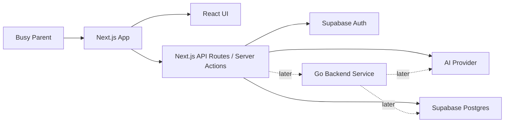
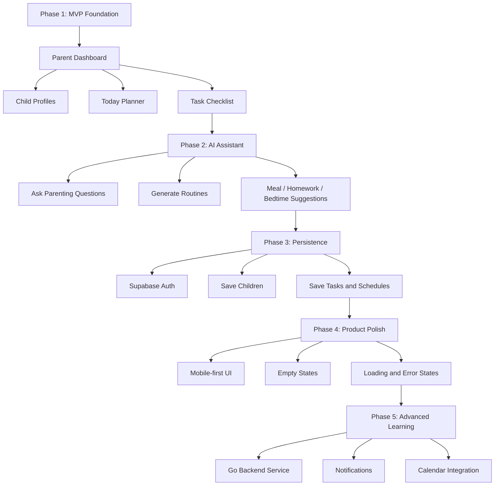
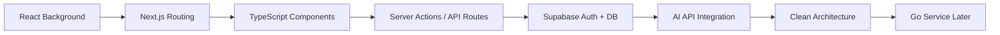

# ParentPal AI Roadmap

ParentPal AI is an app for busy parents who need simple, practical help organizing family life.

## Product Goal

Help parents quickly answer:

- What needs to happen today?
- What does each child need?
- What tasks, routines, meals, appointments, or school items should I remember?
- Can AI help me make a simple plan without overwhelming me?

## Recommended Tech Stack

```text
Frontend + App Framework: Next.js + React + TypeScript
Styling: Tailwind CSS
Auth + Database: Supabase
AI: OpenAI API or compatible provider later
Deployment: Vercel first
Future Backend: Go service when needed
```

## Architecture Direction



## Product Roadmap



## Learning Roadmap



## Phase 1: MVP Foundation

Goal: create a usable first screen with mock data.

Features:

- Parent greeting
- Child profile summary
- Today's schedule
- Task checklist
- AI assistant input box
- Mock AI response

What I should learn:

- Next.js project structure
- App Router basics
- React component design
- TypeScript props
- Tailwind layout
- How to split UI into reusable components

## Phase 2: AI Assistant

Goal: allow the parent to ask for practical help.

Example prompts:

- “Create a bedtime routine for a 5-year-old.”
- “Suggest lunch ideas for tomorrow.”
- “Help me plan homework and dinner after work.”
- “My child is having a tantrum. What can I try?”

What I should learn:

- API routes or server actions
- Environment variables
- Calling an AI API safely
- Prompt design
- Loading and error states

## Phase 3: Supabase

Goal: save real user data.

Features:

- Parent sign up / login
- Child profiles
- Saved tasks
- Saved routines
- Daily plans

What I should learn:

- Supabase Auth
- Postgres tables
- Row Level Security
- CRUD operations
- Data modeling

## Phase 4: Product Polish

Goal: make the app feel usable and presentable.

Focus areas:

- Mobile-first layout
- Empty states
- Form validation
- Error handling
- Accessibility
- Dashboard polish
- Screenshots for portfolio

## Phase 5: Future Go Backend

Goal: introduce Go only when there is a real reason.

Possible Go services:

- Notification service
- Calendar sync service
- Recommendation engine
- Background job worker
- Separate API layer

What I should learn:

- Go HTTP APIs
- REST contracts
- Service boundaries
- Dockerizing Go services
- Connecting Go to Supabase Postgres

## Architecture Decision Notes

### Why Next.js instead of Vite?

Next.js is better for this project because ParentPal AI will likely need:

- Auth
- Database access
- Server-side logic
- AI API calls
- Protected pages
- Easy deployment
- Portfolio-friendly full-stack experience

Vite is excellent for frontend-only React apps, but this project is more naturally a full-stack app.

### Why Supabase?

Supabase gives me:

- Postgres database
- Authentication
- Storage
- Realtime features
- Quick backend setup

It lets me build faster while still learning real backend concepts.

### Why not Go immediately?

Go is still part of the learning plan, but adding it too early can make the first version harder to finish.

The better path is:

1. Build the app with Next.js and Supabase.
2. Understand the product and data model.
3. Add Go later for a specific backend service.

## Portfolio Goal

This project should show:

- Product thinking
- Frontend skill
- Full-stack architecture
- AI integration
- Database design
- Clean documentation
- Learning discipline

A good future portfolio summary:

> ParentPal AI is a full-stack AI parenting assistant built with Next.js, TypeScript, Supabase, and AI APIs. It helps busy parents organize daily routines, tasks, and child-specific planning, with an architecture designed to support future Go backend services.