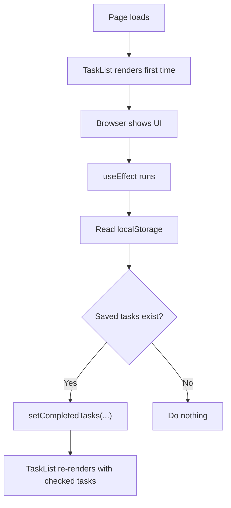
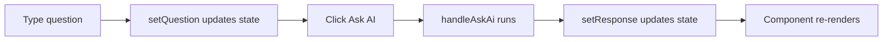

TaskList Flow

```mermaid
flowchart TD
    A["Page loads"] --> B["TaskList renders first time"]
    B --> C["Browser shows UI"]
    C --> D["useEffect runs"]
    D --> E["Read localStorage"]
    E --> F{"Saved tasks exist?"}
    F -- "Yes" --> G["setCompletedTasks(...)"]
    G --> H["TaskList re-renders with checked tasks"]
    F -- "No" --> I["Do nothing"]
```

AIAssistant Flow

```mermaid
flowchart LR
    A["Type question"] --> B["setQuestion updates state"]
    B --> C["Click Ask AI"]
    C --> D["handleAskAi runs"]
    D --> E["setResponse updates state"]
    E --> F["Component re-renders"]
```

app/         = pages and API routes
components/  = UI pieces
data/        = temporary/mock data
lib/         = reusable logic/helpers