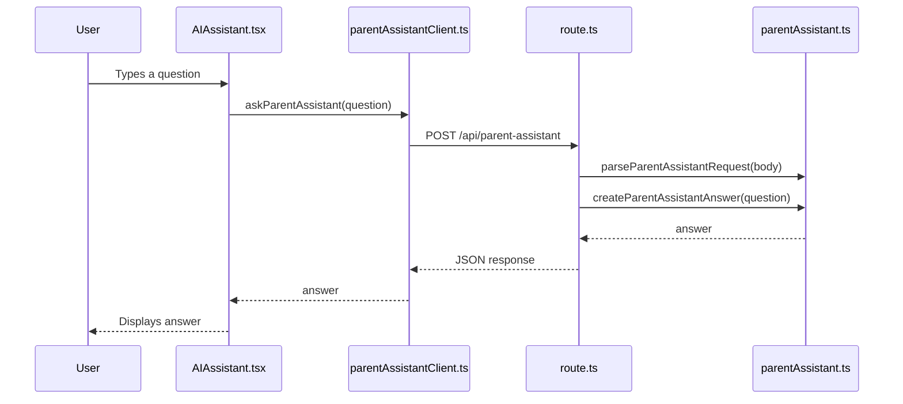

# ParentPal AI Architecture Layers

## Current Flow



## Layer Responsibilities

| Layer | File | Responsibility |
|---|---|---|
| UI Layer | `components/AIAssistant.tsx` | Handles input, loading, and displaying answers |
| API Client Layer | `lib/parentAssistantClient.ts` | Calls the API route using `fetch` |
| API Route Layer | `app/api/parent-assistant/route.ts` | Receives HTTP requests and returns JSON |
| Domain Layer | `lib/parentAssistant.ts` | Validates input and creates assistant answers |

## Design Rule

```text
UI should know about user interaction.
Client should know about fetch.
Route should know about HTTP.
Domain should know about business rules.
```

## Why This Matters

This structure keeps the app easier to test, easier to change, and safer when real AI and database logic are added later.