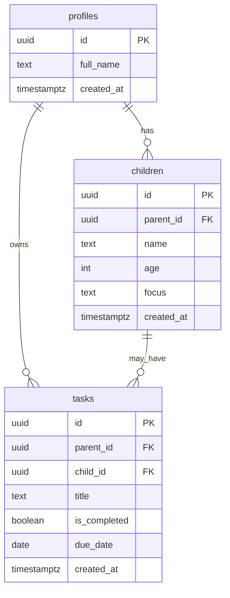

# ParentPal AI Supabase Data Model

## Goal

Move ParentPal from browser-only mock/local data to real saved family data.

## First Tables



## Table Responsibilities

| Table | Purpose |
|---|---|
| `profiles` | Stores app-specific user profile data |
| `children` | Stores each child profile for a parent |
| `tasks` | Stores parent/family tasks |

## Why `profiles`?

Supabase Auth manages login users in `auth.users`.

The app should not directly edit `auth.users`, so we create a public `profiles` table linked to the authenticated user ID.

## Security Goal

Each logged-in parent should only access their own data.

Example rule:

```text
A parent can read/write rows where parent_id equals their authenticated user ID.
```

## MVP Scope

For the first Supabase version:

- Sign in/sign up
- Save children
- Save tasks
- Load dashboard data from database
- Replace localStorage task completion

## Later Tables

Possible future tables:

- `daily_plans`
- `routines`
- `assistant_messages`
- `appointments`
- `meal_ideas`


## First Supabase Integration

The first database-backed feature is the dashboard child profile list.

Flow:

```mermaid
flowchart LR
    A["app/page.tsx"] --> B["getChildren()"]
    B --> C["supabaseClient.ts"]
    C --> D["Supabase children table"]
    D --> A